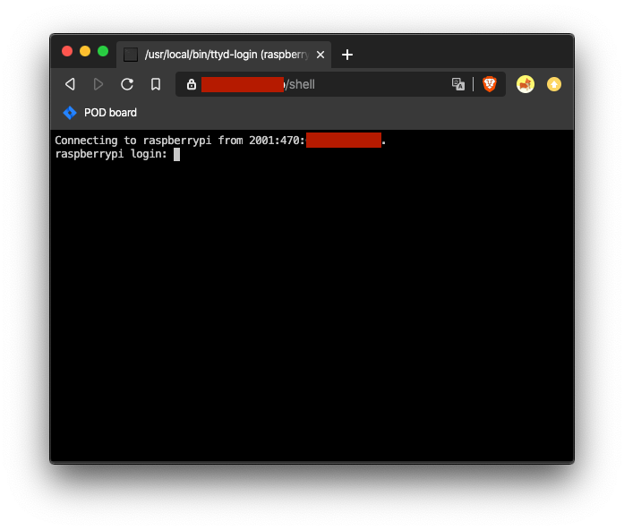

# httpsh 🔒🐚 – secure shell in your browser
A bunch of scripts and configs that allows to expose a shell via HTTPS.



## Project requirements
* works as a system service
* the service fulfills the principle of minimal privilege (can't simply use `/bin/login` as it requires root privileges)
* exposes a web client with the user's shell
* supports password authentication
* has an optional protection against brute force attacks
* uses secure transport protocols

## Dependencies
The project depends on bash, ssh (client+server), systemd, **[ttyd](https://tsl0922.github.io/ttyd/)**, nginx, grep and optionally fail2ban (if you want to have a brute force protection). sshd must be configured for accepting incoming local connections.

Everything was tested on Debian Linux.

## Installation
1. Copy the config files ([`etc`](etc) folder) to the corresponding directories in your system.
2. [Download ttyd](https://github.com/tsl0922/ttyd/releases) and put the executable in `/usr/local/bin/ttyd`. You can choose another directory, but don't forget to edit the config files.
3. Put [`ttyd-login`](usr/local/bin/ttyd-login) script in `/usr/local/bin/ttyd-login`. Apply `chmod +x` for both executables.
4. Create a user named `ttyd`, with a home directory and disabled login shell. It is required for `~/.ssh` files. The home can be custom, for example `/var/local/ttyd/`:
```
# mkdir -p /var/local/ttyd
# useradd -d /var/local/ttyd -s /bin/false ttyd
# chown -R ttyd:ttyd /var/local/ttyd
```
5. Add a new location in nginx configuration for your domain. If you want to have a shell under `https://example.com/shell`, add this to the `server` section:
```
location ~ ^\/shell(\/.*)?$ {
  include snippets/shell.conf;
}
```

## Running the service
1. Reload systemd unit files `systemctl daemon-reload`.
2. Restart all edited services:
```
# systemctl restart nginx
# systemctl restart fail2ban
```
3. Start `httpsh` service and enable the autostart during the system startup:
```
# systemctl start ttyd@shell
# systemctl enable ttyd@shell
```
4. The shell should be up and running under `https://example.com/shell`

### **Done! 🎉🏆**

## Recommendations
I recommend to use fail2ban protection and TLS v1.3 for your domain. **DO NOT** use plain HTTP without TLS – it's like using telnet instead of ssh.

## Questions and suggestions
If you have any questions, please create a new Github issue.
